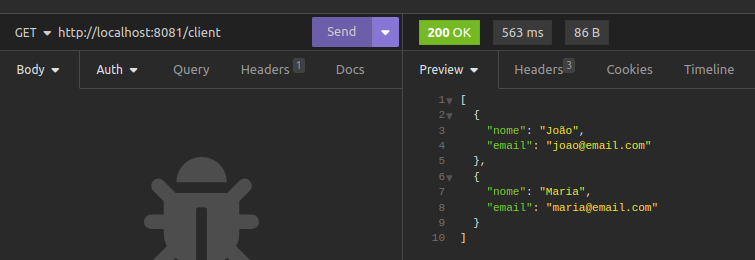
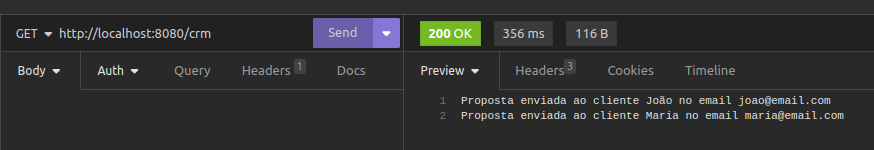
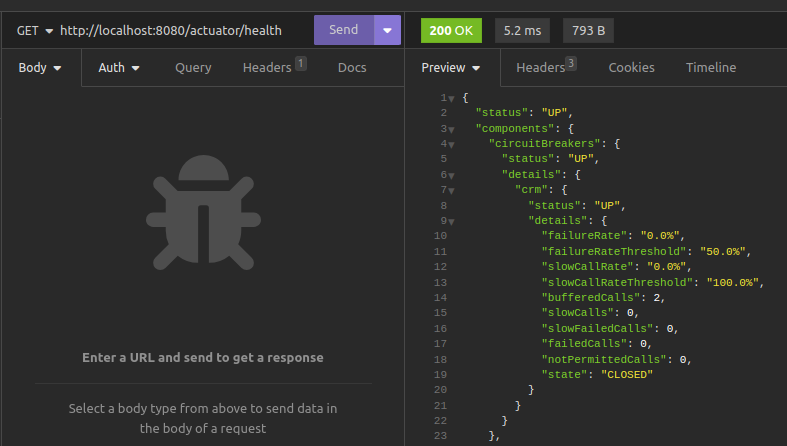
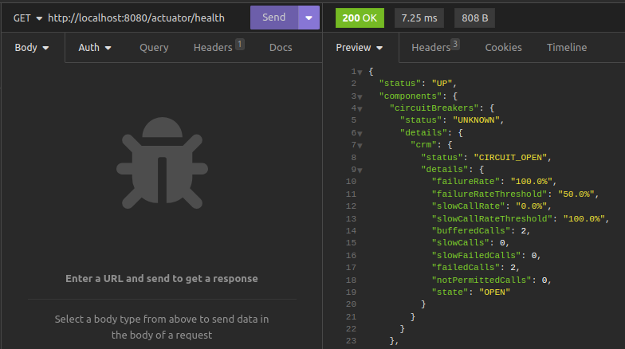
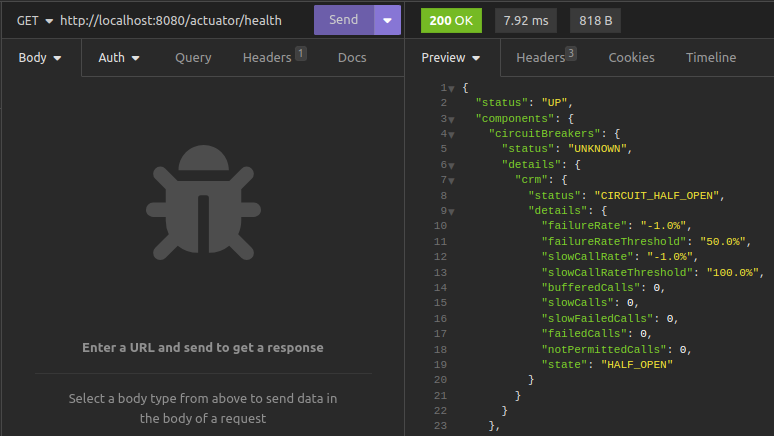

# Entendendo o Padrão Circuit Breaker: Uma Abordagem para Resiliência em Sistemas Distribuídos

Sistemas distribuídos desempenham um papel crucial na arquitetura de software moderna, permitindo escalabilidade e flexibilidade. No entanto, a complexidade inerente a esses ambientes pode resultar em falhas intermitentes e imprevisíveis. 

Para enfrentar esse desafio, existem os padrões de projeto que promovem resiliência e garantem o funcionamento estável do sistema, mesmo em condições adversas. Um desses padrões essenciais é o "Circuit Breaker" (Disjuntor).

## O que é o Padrão Circuit Breaker?

O Padrão Circuit Breaker é uma técnica de gerenciamento de falhas projetada para detectar e lidar com falhas intermitentes em sistemas distribuídos. 

Inspirado pelo conceito de disjuntores elétricos, que interrompem a corrente elétrica quando há uma sobrecarga, o Circuit Breaker atua como uma barreira entre os componentes de um sistema, impedindo a propagação de falhas e permitindo a recuperação adequada.


## Estados do Circuit Breaker

**Estado Fechado (Closed)**: Neste estado, o Circuit Breaker permite a passagem de chamadas e monitora a ocorrência de falhas. Se o número de falhas ultrapassar um limite previamente definido, o Circuit Breaker muda para o estado aberto.

**Estado Aberto (Open)**: Quando o Circuit Breaker está aberto, ele impede que as chamadas sejam encaminhadas, fornecendo uma resposta rápida para evitar sobrecarregar um sistema já prejudicado. Durante esse tempo, o Circuit Breaker pode direcionar as chamadas para uma função alternativa, como uma resposta padrão ou cache.

**Estado Meio-Aberto (Half-Open)**: Após um período definido, o Circuit Breaker muda para o estado meio-aberto, permitindo que algumas chamadas passem. Se essas chamadas forem bem-sucedidas, o Circuit Breaker volta ao estado fechado, caso contrário, permanece no estado aberto, indicando que o sistema ainda não se recuperou totalmente.


## Benefícios do Padrão Circuit Breaker

**Resiliência**: Ao detectar e responder rapidamente a falhas, o Circuit Breaker evita que essas falhas se propaguem, aumentando a resiliência do sistema.

**Recuperação Rápida**: A capacidade de desativar temporariamente partes do sistema e direcionar o tráfego para alternativas permite uma recuperação rápida e eficiente.

**Monitoramento**: O Circuit Breaker fornece dados valiosos sobre o estado do sistema, ajudando os desenvolvedores a identificar e corrigir problemas de forma proativa.

### Evitando Chamadas Desenecessárias

O padrão Circuit Breaker também contribui para evitar chamadas desnecessárias a serviços ou componentes que estão falhando ou não respondendo adequadamente. 

Ao abrir o circuito em resposta a falhas, a aplicação evita tentativas repetidas de acessar um serviço degradado, economizando recursos e reduzindo o impacto nas partes do sistema que ainda estão operacionais. 

Essa prática contribui para a eficiência geral do sistema, garantindo que os recursos não sejam desperdiçados em chamadas inúteis durante períodos de instabilidade.

## Caso de Uso: Resiliência na Comunicação entre Serviços de Clientes e CRM com Resilience4j e Circuit Breaker

Em um cenário essencial de comunicação entre serviços, a garantia de resiliência é de suma importância para manter a estabilidade do sistema. 

Neste caso de uso específico, exploramos a integração de dois serviços Spring Boot Controllers: o "Serviço de Clientes", que fornece informações sobre clientes via operações GET, e o "Serviço CRM", que consome o primeiro para criar notificações personalizadas.

Para assegurar a resiliência na comunicação entre esses serviços críticos, incorporamos o padrão Circuit Breaker do Resilience4j. Ao utilizar o Circuit Breaker, monitoramos dinamicamente a comunicação. Se o "Serviço de Clientes" enfrentar falhas excessivas, o Circuit Breaker entra em ação, evitando chamadas adicionais temporariamente, impedindo assim a propagação de falhas e garantindo uma recuperação rápida quando o serviço se estabiliza.

O "Serviço CRM", que constrói notificações com base nos dados obtidos do "Serviço de Clientes", destaca a necessidade crucial de resiliência. Graças ao Resilience4j, ajustamos facilmente as configurações do Circuit Breaker, adaptando-as dinamicamente às necessidades do sistema. Essa abordagem não apenas fortalece a resiliência da comunicação entre serviços, mas também fornece insights valiosos sobre o estado do sistema por meio do Spring Boot Actuator.

Em resumo, este caso de uso exemplifica como a implementação do Resilience4j com Circuit Breaker torna nossa arquitetura de microserviços mais robusta contra falhas, garantindo uma recuperação rápida e eficaz, e proporcionando uma experiência consistente para os usuários finais.


### Resilience4j

O Resilience4j simplifica a implementação do padrão Circuit Breaker em Java com Spring Boot, proporcionando uma camada robusta de resiliência para as aplicações distribuídas que se comunicam entre si via HTTP. 

Com apenas algumas linhas de código, é possível proteger as aplicações contra falhas externas. O Circuit Breaker monitora chamadas a um serviço e, se muitas falharem, ele "abre", evitando chamadas adicionais temporariamente. Isso previne a propagação de falhas, permitindo uma rápida recuperação quando o serviço se estabiliza. 

Além disso, ao integrar o Spring Boot Actuator, pode-se aproveitar os seus recursos de monitoramento e gerenciamento fornecidos pelo Actuator. Isso inclui endpoints específicos para verificar o estado dos Circuit Breakers, possibilitando uma visão detalhada do comportamento e do desempenho da resiliência em tempo real. 

O Resilience4j, combinado com o Spring Boot Actuator, oferece uma solução abrangente para aprimorar a confiabilidade e a estabilidade do seu sistema Java.

Documentação oficial da implementação do Circuit Breaker pelo Resilience4J (https://resilience4j.readme.io/docs/circuitbreaker).

### Circuit Breaker Além do Java e Resilience4j

Embora estejamos exemplificando o padrão Circuit Breaker com Java Spring Boot e a biblioteca Resilience4j, ele é um conceito adotado por outras linguagens e plataformas, demonstrando sua versatilidade e aplicabilidade em diferentes ecossistemas.

**.NET (C#)**:
No ecossistema .NET, a biblioteca Polly oferece suporte robusto para implementação de Circuit Breaker. Com recursos flexíveis, os desenvolvedores podem fortalecer a resiliência de suas aplicações em ambientes .NET, garantindo uma gestão eficiente de falhas.

**Go (Golang)**:
Em Go, a biblioteca "github.com/sony/gobreaker" proporciona uma implementação eficaz do Circuit Breaker. A simplicidade e a concisão do Go se refletem nessa biblioteca, permitindo aos desenvolvedores alcançar resiliência em seus serviços de maneira direta.

**AWS**:
Na nuvem da AWS, o Amazon API Gateway e AWS Circuit Breaker Patterns são ferramentas valiosas. Ao utilizar recursos nativos da AWS, como API Gateway, AWS Lambda, DynamoDB, Step Functions, etc, é possível implementar estratégias de Circuit Breaker em arquiteturas serverless, garantindo a estabilidade e a resiliência dos serviços.

Esses exemplos ilustram como o conceito de Circuit Breaker transcende fronteiras tecnológicas, oferecendo soluções consistentes e eficazes em diferentes ambientes de desenvolvimento e infraestrutura.

## Serviço de Clientes

A classe ClientController age como uma espécie de "catálogo de clientes" para o nosso Serviço CRM. Quando o Serviço CRM precisa enviar notificações personalizadas para clientes específicos, ele faz uma visita a este "catálogo". Aqui, ele encontra as informações sobre clientes, como nomes e emails.

A ClientController, ao receber as requisições, entrega uma lista com dois clientes de exemplo, João e Maria, cada um com seu nome e email. Estes dados são exatamente o que o Serviço CRM precisa para criar mensagens personalizadas e encaminhá-las aos clientes certos.

```hcl
@RestController
@RequestMapping("/client")
public class ClientController {

    @GetMapping
    public List<Map<String, String>> client(){

        List<Map<String, String>> clients = new ArrayList<>();

        Map<String, String> client1 = new HashMap<>();
        client1.put("nome", "João");
        client1.put("email", "joao@email.com");

        Map<String, String> client2 = new HashMap<>();
        client2.put("nome", "Maria");
        client2.put("email", "maria@email.com");

        clients.add(client1);
        clients.add(client2);

        return clients;
    }
}
```

### Dependências (Arquivo pom.xml)

- **spring-boot-starter-web**: Adiciona as dependências essenciais para criar aplicativos Spring Boot baseados na web.

```hcl
	<dependencies>
		<dependency>
			<groupId>org.springframework.boot</groupId>
			<artifactId>spring-boot-starter-web</artifactId>
		</dependency>
	</dependencies>
```

### Configurações de Porta de Execução (Arquivo application.yml):

A definição da porta 8081 indica o número da porta do servidor. 

```hcl
server:
  port: 8080
```

Ao executar o Serviço de Clientes na porta 8081, o resultado esperado é a listagem dos dados nome e email dos clientes João e Maria.




## Serviço CRM

O "Serviço CRM" atua como o criador de propostas, utilizando o "Catálogo de Clientes" (Serviço de Clientes) para personalizar mensagens. 

A notação **@CircuitBreaker** garante que, se o Serviço de Clientes estiver indisponível, o Circuit Breaker entra em ação, evitando impactos e acionando automaticamente o método Fallback. O método **ciruitBreakerFallback** fornece uma mensagem padrão, assegurando que o Serviço CRM continue operacional, mesmo em momentos de instabilidade do Serviço de Clientes.

```hcl
@RestController
@RequestMapping("/crm")
public class CrmController {

    @GetMapping
    @CircuitBreaker(name = "crm", fallbackMethod = "ciruitBreakerFallback")
    public String crm(){

        RestTemplate restTemplate = new RestTemplate();

        List<Map<String, Object>> clients = restTemplate.getForObject("http://localhost:8081/client", List.class);

        String crmMessage = clients.stream()
                .map(client -> "Proposta enviada ao cliente " + client.get("nome") + " no email " + client.get("email"))
                .collect(Collectors.joining("\n"));

        return crmMessage;
    }

    public String ciruitBreakerFallback(Exception e){

        return "Fallback: Serviço de Clientes está fora do ar";
    }
}
```

### Dependências (Arquivo pom.xml)

- **spring-boot-starter-web**: Adiciona as dependências essenciais para criar aplicativos Spring Boot baseados na web.
- **spring-cloud-starter-circuitbreaker-resilience4j**: Integra o Resilience4j ao Spring Cloud Circuit Breaker, proporcionando resiliência a falhas no estilo Circuit Breaker.
- **spring-boot-starter-actuator**: Inclui o Starter Actuator, que fornece recursos de monitoramento e gerenciamento para aplicativos Spring Boot.

```hcl
	<dependencies>
		<dependency>
			<groupId>org.springframework.boot</groupId>
			<artifactId>spring-boot-starter-web</artifactId>
		</dependency>
		<dependency>
			<groupId>org.springframework.cloud</groupId>
			<artifactId>spring-cloud-starter-circuitbreaker-resilience4j</artifactId>
		</dependency>
		<dependency>
			<groupId>org.springframework.boot</groupId>
			<artifactId>spring-boot-starter-actuator</artifactId>
		</dependency>
	</dependencies>
```

### Configurações de Saúde e Circuit Breaker (Arquivo application.yml):

As configurações abaixo visam estabelecer um ambiente resiliente e monitorado para o Serviço CRM. A definição da porta 8080 indica o número da porta do servidor. 

As configurações do Spring Boot Actuator (management e endpoints) habilitam recursos de monitoramento, expondo informações detalhadas sobre a saúde do sistema e ativam o Circuit Breaker para lidar com falhas no Serviço CRM. As propriedades específicas do Resilience4j (resilience4j) configuram o Circuit Breaker para o "crm". 

O registerHealthIndicator: true integra o estado do Circuit Breaker ao indicador de saúde, proporcionando uma visão clara da resiliência. Além disso, as configurações de tempo (waitDurationInOpenState: 5s) e quantidade de chamadas (minimumNumberOfCalls: 2, permittedNumberOfCallsInHalfOpenState: 3) ajustam o comportamento do Circuit Breaker, especificando o tempo de espera antes da transição para o estado meio aberto, o número mínimo de chamadas antes de considerar a abertura, e o número permitido de chamadas no estado meio aberto. 

```hcl
server:
  port: 8080

management:
  health:
    circuitbreakers:
      enabled: true
  endpoints:
    web:
      exposure:
        include: health
  endpoint:
    health:
      show-details: always

resilience4j:
  circuitbreaker:
    instances:
      crm:
        registerHealthIndicator: true
        eventConsumerBufferSize: 10
        failureRateThreshold: 50
        minimumNumberOfCalls: 2
        automaticTransitionFromOpenToHalfOpenEnabled: true
        waitDurationInOpenState: 5s
        permittedNumberOfCallsInHalfOpenState: 3
        slidingWindowSize: 10
        slidingWindowType: COUNT_BASED
```

Ao executar o Serviço CRM na porta 8080, realizando uma requisição com sucesso so Serviço de Clientes, o resultado esperado é a montagem de uma notificação personalizada aos clientes João e Maria, utilizando os dados recuperados.



Ao consultar a URL do Actuator configurado para monitorar a saúde do Serviço CRM, nota-se que o estado do Circuit Breaker está CLOSED. Isso significa que a comunicação do Serviço CRM com o Serviço de Clientes está no ar.




## Agora Valendo: Testando o Circuit Breaker 

O Serviço de Clientes será derrubado e ao executá-lo, o resultado esperado é que ele não responda na porta 8081.


Com o Serviço de Clientes fora do ar, caso o Serviço CRM tente enviar requisições para consultar os clientes, o método de Fallback será acionado e retornará a mensagem de erro. 


Ao consultar a novamente a URL do Actuator, nota-se que o estado do Circuit Breaker mudou para OPEN. Isso significa que o Serviço de Clientes ao qual depende, está fora do ar.



Neste momento e nessa situação, o Circuit Breaker não permite requisições ao Serviço de Clientes, e começa a enviar notificações periódicas para verificar se se obtém resposta, e enquanto isso, o estado passa a ser HALF_OPEN.



Ao executar novamente o Serviço de Clientes, o mesmo para a responder na porta 8081.


Conseguentemente, caso o Serviço CRM faça novas requisições, obterá a resposta e passará a gerar as notificações aos clientes João e Maria, uma vez que obteve os dados.


Ao consultar novamente a URL do Actuator, o estado do Circuit Breaker assumirá por um tempo o estado de HALF_OPEN. 


... e logo em seguida volta ao estado CLOSED, indicando que a comunicação com o Serviço de Clientes está no ar.


## Conclusão

O Padrão Circuit Breaker é uma ferramenta valiosa para garantir a resiliência de sistemas distribuídos em frente a falhas imprevistas. 

Ao implementar esse padrão, melhoramos a estabilidade, o desempenho e a eficácia dos sistemas distribuídos, proporcionando uma experiência mais confiável para os usuários finais. 

A compreensão e a aplicação adequada do Padrão Circuit Breaker são essenciais para a construção de arquiteturas robustas e resilientes em ambientes distribuídos.


